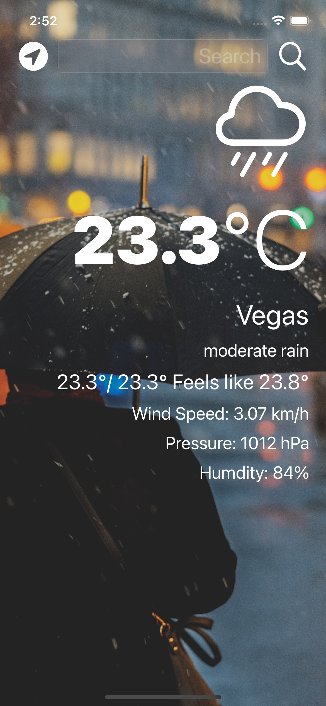

# World Weather IOS ☁️ 

#### World Weather IOS is an mobile application that gives you weather data based on the city name. Uses  [Open Weather API](https://openweathermap.org/) to get live weather data from over 200,000+ cities. World Weather IOS also uses GPS location to get the weather data at your current location.  Built using MVC and Delegation design patterns. 

#### Demo of App with the "Vegas Prompt"
 

